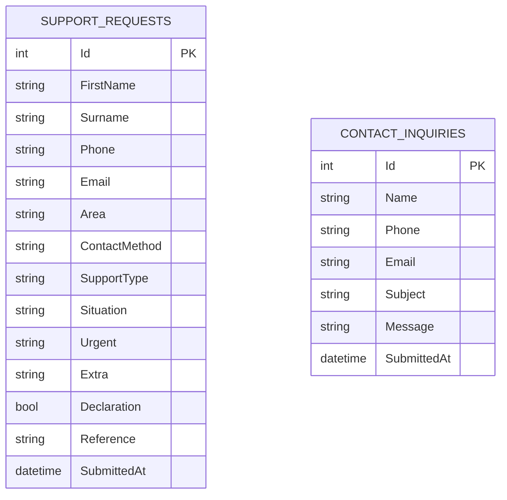

# Philisa Abantu Bethu – Help Centre

**Web Application – Project README**

Developed by **Team KANTU** for **Philisa Abafazi Bethu**

---

## Table of Contents

1. [Overview](#1-overview)
2. [Functional Requirements](#2-functional-requirements)
3. [Non-Functional Requirements](#3-non-functional-requirements)
4. [Features](#4-features)
5. [Technology Stack](#5-technology-stack)
6. [System Architecture](#6-system-architecture)
7. [Languages and Localisation](#7-languages-and-localisation)
8. [Data Model](#8-data-model)
9. [Security and Privacy](#9-security-and-privacy)
10. [Getting Started](#10-getting-started)
11. [Project Structure](#11-project-structure)
12. [Deployment and Workflow](#12-deployment-and-workflow)
13. [Running Costs](#13-running-costs)
14. [Project Status and Future Work](#14-project-status-and-future-work)
15. [AI Usage Declaration](#15-ai-usage-declaration)
16. [Attendance](#16-attendance)
17. [The Team](#17-the-team)

---

## 1. Overview

The Philisa Abantu Bethu Help Centre is a public website where community members can ask Philisa Abafazi Bethu (PAB) for help, **without creating an account**. The name means *"Heal Our People"*.

- **Why it was built:** asking PAB for help currently means phoning them, so people need to already know the organisation. The Help Centre gives anyone a simple online way to reach PAB, and one place to find programmes and resources.
- **Who uses it:** community members only. There is deliberately no login, because an account would be a barrier for someone in a difficult or unsafe situation.

> For background on PAB and how the requirements were gathered, see the **Philisa Volunteers** README.

### 1.1 Links

- **Live site:** *link to be added*
- **Demo video:** *unlisted YouTube link, to be added once uploaded*

---

## 2. Functional Requirements

| ID | Requirement | Status |
|----|-------------|:------:|
| PAB-FR01 | Request support without creating an account or signing in. | ✔ |
| PAB-FR02 | Submit a support request through a simple, step-by-step form. | ✔ |
| PAB-FR03 | Choose a preferred contact method. | ✔ |
| PAB-FR04 | Select or describe the type of support needed. | ✔ |
| PAB-FR05 | Give PAB the information it needs to respond. | ✔ |
| PAB-FR06 | Receive confirmation once a request is submitted. | ✔ |
| PAB-FR07 | Access helpful resources. | ✔ |
| PAB-FR08 | View information about PAB's programmes. | ✔ |
| PAB-FR09 | Switch between English and isiXhosa. | ✔ Also Afrikaans |
| PAB-FR10 | Submit a request from outside PAB's main service areas. | ✔ |

**Added during development:** a **Contact** form for general messages, such as volunteering, donations and media enquiries.

---

## 3. Non-Functional Requirements

| Category | How the Website Meets It |
|----------|--------------------------|
| **Accessibility** | Three languages, a "Skip to content" link, labelled form fields and icon buttons, and a page `lang` attribute that matches the chosen language so screen readers pronounce it correctly. |
| **Responsiveness** | Built mobile-first with Tailwind CSS, with a collapsible menu on small screens and cards and galleries that adapt to the screen width. |
| **Usability** | The support form is split into three short steps with a progress bar and a summary before submitting. **Request Support** is always in the header. |
| **Reliability** | Requests are saved before the confirmation page is shown, and the production database sits on a persistent volume that survives redeploys. |
| **Security** | HTTPS, anti-forgery tokens, automatic output encoding and parameterised queries (see section 9). |

---

## 4. Features

### 4.1 Pages

| Page | What It Does |
|------|--------------|
| **Home** | Introduces PAB, with buttons to request support or explore programmes |
| **About Us** | PAB's story, mission, values, founder and team |
| **Our Programmes** | All ten programmes, each with its own page |
| **Programme detail** | Overview, objectives, activities, a photo gallery and testimonials |
| **Resources** | Emergency numbers and helpful contacts, plus FAQs |
| **Request Support** | The three-step support request form |
| **Confirmation** | Confirms the request and gives a reference number |
| **Contact** | A general contact form and PAB's contact details |
| **Privacy Policy** | How personal information is used, in line with POPIA |

### 4.2 The Request Support Form

| Step | What the Person Fills In |
|------|--------------------------|
| **1. About You** | Name, phone number, email (optional), area, and preferred contact method: phone, WhatsApp, email or in-person visit |
| **2. Support Needed** | Type of support, a description of their situation, and whether it's urgent. A reminder to call **10111** or PAB's crisis line in an emergency. |
| **3. Confirm and Submit** | Anything else to add (optional), a summary of the request, and a consent declaration that must be ticked |

After submitting, the person sees a **reference number**, the date, the status ("Received") and what happens next.

**Types of support:** Food Assistance, Women's Empowerment, Youth Support, After-school Programme, Senior Care, Baby Saver Programme, Emergency Shelter, Search & Rescue, Social Work Services, and General Help / Not Sure.

### 4.3 Programmes and Resources

- **Programmes:** Women's Empowerment, Youth Programme, After-school Programmes, Senior Programme, Community Feeding, Baby Saver, Emergency Safe Houses, Search & Rescue, Social Work Services and Men's Café. Each page uses PAB's own photos, with a gallery that opens pictures full size.
- **Resources:** contacts grouped into Community Services, Emergency Contacts, Women's Rights, Parenting Resources and Mental Health, plus frequently asked questions such as *"Is my request kept private?"*

---

## 5. Technology Stack

| Area | Technology |
|------|------------|
| Framework | ASP.NET Core Razor Pages (.NET 10), C# |
| Database | SQLite, through Entity Framework Core 10 |
| Styling | Tailwind CSS, with Lora and Inter fonts |
| Client-side scripts | Plain JavaScript (form steps, mobile menu, FAQ, photo gallery) |
| Hosting | Docker, on Railway |
| Version control | Git and GitHub |

**Why Razor Pages:** each page keeps its layout and logic together, which suits a content website with a few forms, and pages are rendered on the server, so they load quickly on slow connections.

**Why SQLite:** the whole database is one file, so there's no separate database server to run or pay for. Entity Framework creates and updates it automatically when the app starts.

> **Change from the design document:** the design planned Google Cloud Firestore for both systems. The website only needs to save two kinds of form submissions, so we moved it to SQLite, which is simpler and cheaper.

---

## 6. System Architecture

```
┌──────────────────────────────────────────────────────────────┐
│  BROWSER                                                     │
│  HTML pages · Tailwind CSS · form steps, menu, FAQ, gallery  │
└───────────────────────────┬──────────────────────────────────┘
                            │ HTTPS
┌───────────────────────────▼──────────────────────────────────┐
│  ASP.NET CORE (Razor Pages)                                  │
│  Pages/             Page + PageModel for each screen         │
│  Localization/      English, isiXhosa and Afrikaans text     │
│  Data/SiteData      Programme content (stored in code)       │
│  Data/AppDbContext  Entity Framework database access         │
└───────────────────────────┬──────────────────────────────────┘
                            │
┌───────────────────────────▼──────────────────────────────────┐
│  SQLite DATABASE (philisa.db)                                │
│  SupportRequests · ContactInquiries                          │
└──────────────────────────────────────────────────────────────┘
```

### 6.1 How a Support Request Is Handled

1. The browser checks the required fields before each step.
2. On submit, the form is posted to `RequestSupport.cshtml.cs`.
3. A reference number is created, for example `PAB482`.
4. The request is saved to the `SupportRequests` table.
5. The person is sent to the **Confirmation** page with their reference number.

The **Contact** form works the same way, saving to `ContactInquiries`.

---

## 7. Languages and Localisation

The website is available in **English**, **isiXhosa** and **Afrikaans**.

- The language switcher adds `?lang=en`, `?lang=xh` or `?lang=af` to the page address.
- The choice is saved in a `pab_lang` cookie for one year. The default is English.
- Every piece of text is written in all three languages, and a helper picks the right one:

```csharp
@s.Pick("Skip to content", "Tsibela kumxholo", "Spring na inhoud")
```

- The page's `lang` attribute is set to match (`en-ZA`, `xh-ZA` or `af-ZA`).

---

## 8. Data Model

### 8.1 Entity Relationship Diagram

The database has two independent tables, kept separate on purpose so general messages are never mixed with confidential support requests.



### 8.2 Field Notes

| Field | Values |
|-------|--------|
| `ContactMethod` | `phone`, `whatsapp`, `email` or `visit` |
| `Urgent` | `yes` or `no` |
| `Declaration` | Must be ticked before a request is submitted |
| `Reference` | Shown to the person on the Confirmation page, e.g. `PAB482` |
| `Subject` | General Enquiry, Volunteering, Donations & Partnerships, Media, or Other |

**Programmes** are not stored in the database. They're defined in `Data/SiteData.cs`, because they rarely change and are the same for every visitor.

---

## 9. Security and Privacy

| Area | Measure |
|------|---------|
| No accounts | No passwords to protect, and people only share what's needed to help them |
| HTTPS | All traffic is redirected to HTTPS, with HSTS in production |
| Cross-site request forgery | Razor Pages add and check an anti-forgery token on every form |
| Cross-site scripting | Razor encodes anything a user types before displaying it |
| SQL injection | Entity Framework uses parameterised queries |
| No public access to requests | No page lists or displays submitted requests |
| Consent | A consent declaration must be ticked before submitting |
| Database file | `*.db` files are excluded from Git and the Docker image |

The **Privacy Policy** page explains what is collected and why, that it's never sold or used for marketing, and people's POPIA rights to see, correct or delete their information.

---

## 10. Getting Started

**You need:** the .NET 10 SDK, Visual Studio 2022 or later (or the `dotnet` command line), and Git. Docker Desktop is optional.

**Step 1: Clone the repository**

```bash
git clone https://github.com/Kwethukubonga/philisa-abantu-bethu.git
cd philisa-abantu-bethu
```

**Step 2: Run it**

In Visual Studio, open `PhilisaAbantuBethu.slnx` and click **Run**. Or:

```bash
cd PhilisaAbantuBethu
dotnet run
```

**Step 3: Open the website**

Go to `http://localhost:5277`.

> **Note:** No database setup is needed. `philisa.db` is created automatically the first time the app starts. To view submissions during development, open it with a SQLite viewer such as **DB Browser for SQLite**.

**With Docker:** run `docker compose up --build`, then open `http://localhost:8080`. Submissions are kept in the `philisa-data` volume.

---

## 11. Project Structure

```
philisa-abantu-bethu/
├── PhilisaAbantuBethu/
│   ├── Data/            # AppDbContext and programme content (SiteData)
│   ├── Localization/    # Language switching and text in all three languages
│   ├── Migrations/      # Database migrations
│   ├── Models/          # SupportRequest, ContactInquiry, Programme
│   ├── Pages/           # Every page, plus the shared layout
│   ├── wwwroot/         # CSS, JavaScript and PAB's photos
│   └── Program.cs       # App start-up and language cookie
├── Dockerfile
└── docker-compose.yml
```

---

## 12. Deployment and Workflow

### 12.1 Deployment

The website is hosted on **Railway**, built from the project's `Dockerfile`.

| Setting | Detail |
|---------|--------|
| Build | A two-stage image: the .NET 10 SDK publishes the app, then it runs on the smaller ASP.NET runtime |
| Port | Railway supplies it through the `PORT` variable (default `8080`) |
| Database | Stored at `/data/philisa.db`, on a Railway volume so it survives redeploys |

### 12.2 Branching

```
 feature/* ─► Pull Request ─► Review ─► develop ─► Pull Request ─► main
```

`main` is the deployed version, and `develop` is where features are brought together.

---

## 13. Running Costs

| Item | Estimated Cost |
|------|----------------|
| Railway hosting | From US$5 a month, depending on usage |
| SQLite database and SSL certificate | R0, included |
| `.co.za` domain (optional) | About R99 to register, then about R109 a year |

---

## 14. Project Status and Future Work

### 14.1 Current Status

| Area | Status |
|------|:------:|
| All pages, the support form and the contact form | ✔ Complete |
| English, isiXhosa and Afrikaans | ✔ Complete |
| PAB's real photos and programme galleries | ✔ Complete |
| Saving submissions, Docker and Railway hosting | ✔ Complete |
| Notifying PAB staff of new requests | ☐ Planned |

### 14.2 Future Improvements

- **Email notifications:** send each new request to PAB's intake address, as planned in the design document.
- **Staff view:** a login-protected page where PAB staff can see and manage requests.
- **Server-side validation:** check every submission on the server, not just in the browser.
- **Form abuse protection:** rate limiting and bot protection on the public forms.
- **Tailwind build step:** compile Tailwind into a small CSS file instead of loading it from a CDN, to reduce data use.
- **Automated tests and CI:** like the Philisa Volunteers app.

---

## 15. AI Usage Declaration

### 15.1 Tools Used

- **Claude** (Anthropic), through Claude Code

### 15.2 Where AI Was Used

| Area | How |
|------|-----|
| Code | *To be completed by the team* |
| Translations | *To be completed by the team* |

### 15.3 Example Prompts

- *To be completed by the team*

### 15.4 How We Checked It

- **Purpose:** to speed up development, find and fix errors, and make sure the website met PAB's needs and the project requirements.
- **Checking:** the team set the requirements, reviewed every change through Pull Requests, and tested the website in the browser on phones and computers.

---

## 16. Attendance

All group members attended all group meetings, which took place every Monday.

| Meeting | Kwethukubonga Kunene | Letlhogonolo Kgatshe | Nuha Grimwood | Unathi Mudzengi | Ash Kruger |
|---------|:---:|:---:|:---:|:---:|:---:|
| 17 August 2026 | ✔ | ✔ | ✔ | ✔ | ✔ |
| 24 August 2026 | ✔ | ✔ | ✔ | ✔ | ✔ |
| 31 August 2026 | ✔ | ✔ | ✔ | ✔ | ✔ |
| 7 September 2026 | ✔ | ✔ | ✔ | ✔ | ✔ |
| 14 September 2026 | ✔ | ✔ | ✔ | ✔ | ✔ |
| 21 September 2026 | ✔ | ✔ | ✔ | ✔ | ✔ |
| 28 September 2026 | ✔ | ✔ | ✔ | ✔ | ✔ |

---

## 17. The Team

**Team KANTU:** Kwethukubonga Kunene · Letlhogonolo Kgatshe · Nuha Grimwood · Unathi Mudzengi · Ash Kruger

*Built for Philisa Abafazi Bethu – "Heal Our Women"*
